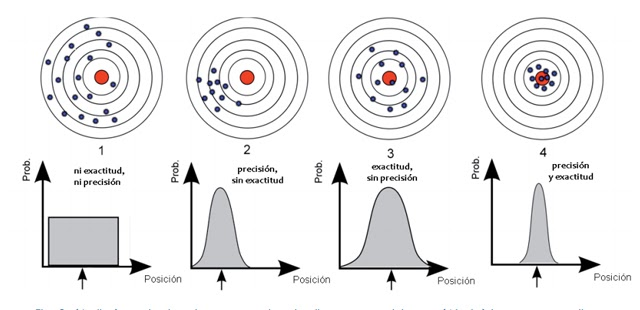

# Sensores y Actuadores.  
## TP semana 2.  

## Ejercicio 1.a:  

*Régimen estático*: Por régimen permanente o estado estacionario, se entiende la zona de la respuesta del sistema en la que, 
tras haber transcurrido tiempo suficiente, todas las señales del sistema se han estabilizado y permanecen a un valor constante, 
mientras no se introduzca una señal externa. 

  
*Régimen dinámico*: Hace referencia al comportamiento del sensor en regimen transitorio. Cuando se produce un cambio en las
magnitudes de un circuito, tensión o corriente, decimos que el circuito está en régimen transitorio. Al cambiar las condiciones de
un elemento de un circuito se pierde el régimen permanente, y tras sucederse los cambios de tensión/ corriente se vuelve de nuevo al
equilibrio en otro régimen permanente. Al intervalo entre los dos regimenes permanentes se le denomina régimen transitorio. 

## Ejercicio 1.e:  

image.png

## Ejercicio 1.i:

La resolución de un sensor es el menor cambio en la magnitud de entrada que se aprecia en la magnitud de salida. 
Sin embargo, la precisión es el máximo error esperado en la medida. La resolución puede ser de menor valor que la precisión. 
 
La sensibilidad es la mínima magnitud en la señal de entrada requerida para producir una determinada magnitud en la 
señal de salida, dada una determinada relación señal/ruido, u otro criterio especificado
